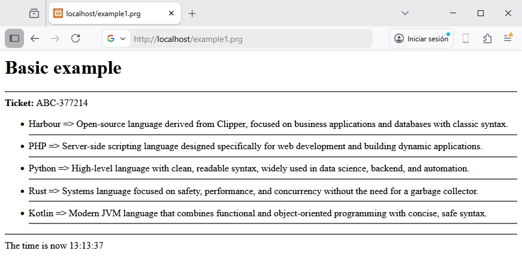

## 📖 Example 1 - Parameters

This example shows how to define the parameter(s) sent from the controller 
and how to use them in a simple loop.

### Controller: example1.prg
```clipper
function main()	

	local cTicket := 'ABC-' + ltrim( Str( hb_RandomInt(100000, 999999) ) )
	local aData   := {;
		{ "Harbour", "Open-source language derived from Clipper, focused on business applications and databases with classic syntax.", .T. },;
		{ "PHP", "Server-side scripting language designed specifically for web development and building dynamic applications.", .F. },;
		{ "Python", "High-level language with clean, readable syntax, widely used in data science, backend, and automation.", .F. },;
		{ "Rust", "Systems language focused on safety, performance, and concurrency without the need for a garbage collector.", .F. },;
		{ "Kotlin", "Modern JVM language that combines functional and object-oriented programming with concise, safe syntax.", .F. };
	}

return UView( 'example1.html', aData, cTicket )
```

### View: example1.html

```html 
@args mydata, cId

<h1>Basic example</h1>
<hr>

<b>Ticket: </b>{{ cId }}

<ul>
	
	@foreach oItem IN myData 
	
		<li>{{ oItem[1] }} => {{ oItem[2] }} </li>
		
		<hr>		
		
	@endforeach			
	
</ul>
<hr>
The time is now {{ time() }}
```

### Result


