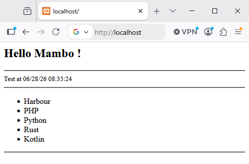

# 🎺️ Mambo - View Engine

## Introduction

**Mambo** is the web template engine built into **HIX** and combines web code 
(HTML, JS, CSS, etc.) with Harbour, facilitating the creation of web pages. 
This greatly simplifies the construction of any page, as it allows you to 
incorporate logic based on the parameters the view receives, all with the help 
of Harbour.

These types of engines focus on simplifying the work of the developer when 
designing web pages. They allow you to quickly create dynamic and powerful pages 
through simple directives to control the flow of information.

Currently, there are some very popular template engines (such as Blade, Twig, 
Smarter, etc.), which basically have two main objectives:

* Simplify page design.

* Provide the community with a common way to design. Everyone works the same way.

## Impact on Productivity

When using these engines, we're not just trying to make things look pretty; it's 
a legitimate engineering choice. By using template inheritance (layouts), you 
avoid copying and pasting headers and footers in each file. Need to change a 
link in the menu? You do it once and it updates across the entire site. 
Additionally, the simplified syntax for loops and conditionals considerably 
reduces complexity.

|Advantages|Description|
|---|---|
|Clean Syntax|Ability to perform macro substitution with elegant `{{ var }}` or, for example, use of functions `{{ time() }}`.|
|Template Inheritance|Allows you to create "master" layouts from which all other views inherit.|
|Built-in Security|Automatically escapes data to prevent XSS attacks by default.| 
|Separation of Concerns|Requires you to keep business logic separate from the presentation layer (HTML).|
|Control Directives|Provides you with structures like `@foreach` or `@if`, much more readable than native code.|
|Reusable Components|Makes it easy to create elements (buttons, alerts) that you can use throughout your website.|
|Error Management|Offers you clearer and more specific error messages, focused on view design.|
|Performance (Caching)|Compiles to native code only once and serves it from cache for maximum speed.|
|Ecosystem and Filters|Numerous extensions to automatically format dates or text.|
|Maintainability|It's much easier to pick up a project months later and understand what's happening.|

## Comparison

Languages like `php` evolved from writing something like this:

```php
<ul>

<?php if (count($usuarios) > 0): ?>

  <?php foreach ($usuarios as $usuario): ?>

    <li><?php echo htmlspecialchars($usuario->nombre, ENT_QUOTES, 'UTF-8'); ?></li>

  <?php endforeach; ?>

<?php else: ?>

  <li>No hay usuarios registrados.</li>

<?php endif; ?>
</ul>
```

To using engines like this, which offer much greater clarity and functionality.

```clipper
<ul>

   @foreach oUser IN oItem[ 'Users' ]
   
      <li>Name: {{ oUser[ 'Name' ] }} </li>
   
   @endforeach

</ul>
```

Key differences in this example:

* **Security:** In pure PHP, if you forget `htmlspecialchars`, you leave the 
door open to XSS attacks. With *Mambo*, macro substitution `{{ }}` handles it 
automatically.

In case we wanted to inject HTML code, we would simply use `{!! !!}`

* **Conciseness:** Uses different directives adapted to classic commands: `@if`, 
`@foreach`, `@for`, etc.

* **Readability:** There's no visual "noise" from server-side opening/closing 
tags, which allows web designers to work faster.

By using an inheritance system, your workflow shifts from "edit 20 files" to 
"edit 1 base file and see the changes in 20 pages". If we add to this that you 
don't have to "manually sanitize each variable", you can deliver projects in a 
fraction of the time.

## UView() - Our Magic Helper

`UView( cView, ... )` is the function you call from any controller. The first 
parameter is the name of the view, and the rest are the parameters you wish to 
pass to it.

In case you have HixStyle activated, the views will be loaded directly from 
the `<cRoot>/views/` folder.

As explained previously, the basic flow is router->controller->view.

This means that a controller processes and collects all the necessary information 
it will send to the view, whose only purpose is to "paint" a screen using this 
data.

Example controller, data collection, and call to Mambo:

```clipper  
function main()

  local aData := { "Harbour", "PHP", "Python", "Rust", "Kotlin" }

  local cInfo := DToC(Date()) + ' ' + time()

return UView( 'welcome.html', aData, cInfo )
```

All that remains is for us to have a view defined `welcome.html`

```html 
@args hMydata = {=>}, cInfo := ''
<html>

<h2>Hello Mambo !</h2>

<hr>
  <small>Test at {{ cInfo }} </small>
<hr>

   <ul>
      @foreach cItem in hMyData
         <li> {{ cItem }}
      @endforeach
   </ul>
   
<hr>

</html>
```

Basically, the code starts by collecting the parameters sent from the controller 
and if they are not sent, it initializes them -> easy.

Then we can see a simple use of a directive, in this case @foreach ... @endforeach 
and how we use the variables with `{{ ... }}`




## View Caching

The system works in two modes:

`live`: analyzes, compiles, and executes the view in real time.

`cached`: directly executes a cached version of the view and only re-analyzes 
and recompiles it if the original source file has changed.

By default, the system uses view caching.

When using `UView()`, the engine stores all compiled views in the `.cached/views` 
folder. If it detects that the original source file has been modified, it will 
analyze, recompile, and execute the view. If the view hasn't changed, it simply 
executes the cached version.

## Page Creation

By default, a page will be HTML, but you can insert and process Harbour code 
inside it. What HixStyle does is combine two environments in one, efficiently 
and easily.

## HTML Code

This is pure web code, where you can insert Harbour macros. The code goes inside 
`{{ }}` and should only contain Harbour code.

```clipper
Hello at {{ time() }}
```

Everything you write inside a macro `{{ }}` is automatically sanitized. You 
don't have to worry about escaping HTML code.

