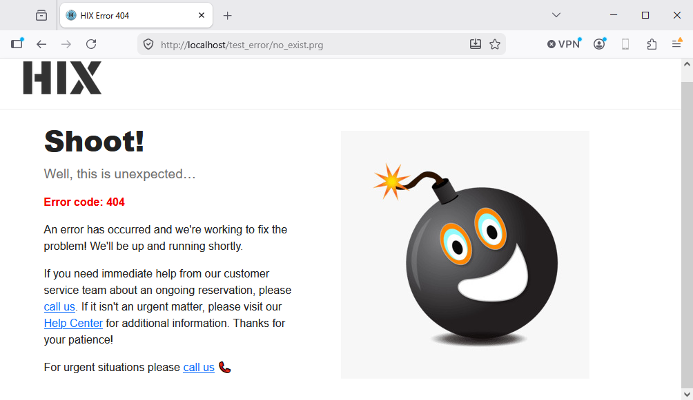

# 🛑 Errorsys - Custom error page

When an action fails, HIX renders an HTML 500 page. By default,
it displays the internal `HIX_ErrorSys` screen.

**Errorsys** allows you to replace that screen with **your own**
`.html` template, using the full HIX view engine.

---

## Configuration

### From `hix.json`

```json
"app" : { 
   "errorsys" : "errorsys.html"
}
```
### Path resolution

`app.errorsys` **does not include the `errors/` folder** in the JSON. HIX adds it
depending on `hixstyle.enabled`:

| `hixstyle.enabled` | JSON value              | Resolved path                          |
|--------------------|-------------------------|----------------------------------------|
| `true`             | `errorsys.html`         | `<cRoot>/errors/errorsys.html`         |
| `true`             | `sub/errorsys.html`     | `<cRoot>/errors/sub/errorsys.html`     |
| `false`            | `errorsys.html`         | `<cRoot>/errorsys.html`                |
| `false`            | `sub/errorsys.html`     | `<cRoot>/sub/errorsys.html`            |

With `hixstyle.enabled=true`, `errors/` is a fixed layout folder
(like `controllers/`, `views/`, `models/`) and is **always** prefixed.
`<cRoot>` comes from `paths.root` in `hix.json` (default: `www`).

Flow:
1. If the template exists **and** renders without error → it is sent to the client.
2. If the template **fails to render** → the *Errorsys Design Error* page is shown
   (dark red background) with the original error plus the template's error.
3. If the template **does not exist** or is empty → falls back to the internal renderer
   (`HIX_ErrorSys`, which in turn respects `app.env`).

---

## The `errorsys.html` template

It is a standard HIX template — same `@args`, `{{ }}`, and rules as
any `.html` file.

It receives a single parameter `hError` (hash) with the error fields:

```html
@args hError

<!DOCTYPE html>
<html lang="en">
<head>
   <meta charset="UTF-8">
   <title>Error {{ hb_NToS(hError['subCode']) }}</title>
   <link href="https://cdn.jsdelivr.net/npm/bootstrap@5.3.3/dist/css/bootstrap.min.css" rel="stylesheet">
   <style>
      body { padding: 2em; font-family: system-ui, sans-serif; }
      pre  { background: #f4f4f4; padding: 1em; }
   </style>
</head>
<body>
   <h1 class="text-danger">Application Error (DEV)</h1>
   <hr>
   <table class="table table-bordered">
      <tr><th>Time</th><td>{{ dtoc(date()) + ' ' + time() }}</td></tr>
      <tr><th>Description</th><td>{{ hError['description'] }}</td></tr>
      <tr><th>Operation</th><td>{{ hError['operation'] }}</td></tr>
      <tr><th>Subsystem</th><td>{{ hError['subsystem'] }}</td></tr>
      <tr><th>File</th><td>{{ hError['file'] }}</td></tr>
      <tr><th>Line</th><td>{{ hb_NToS(hError['line']) }}</td></tr>
      <tr><th>HTTP</th><td>{{ hb_NToS(hError['subCode']) }}</td></tr>
   </table>

   <!-- Raw dump useful in dev: -->
   <h3>Complete dump</h3>
   {!! _w( hError ) !!}
</body>
</html>
```

If you observe the line `{!! _w( hError ) !!}`, it will show all the hash contents.

---


## `www/errors/error_XXX.html` - static HTTP error pages

When the router or dispatcher generates an HTTP error with a code (404, 405,
403, 500…), it calls `HIX_HttpError()`, which in turn uses `HIX_HttpErrorHtml`.
This function searches for:

```
www/errors/error_<CODE>.html
```

- If it exists → it is sent as is as an HTML response.
- If it does not exist → a minimal auto-generated page with the code title and (optionally) the detail is sent.

Example: for a 404, the file is `www/errors/error_404.html`.

---

## Difference between `errorsys` and `error_XXX.html`

|                          | `errorsys`                                          | `error_XXX.html`                    |
|--------------------------|-----------------------------------------------------|-------------------------------------|
| Triggered when…          | The handler PRG throws an **uncaught exception**    | The router/dispatcher returns a specific HTTP code (404, 405, 403…) |
| Processed by…            | `HIX_ShowError()`                                   | `HIX_HttpErrorHtml()`               |
| File type                | Dynamic template `.html` (view engine)              | Plain HTML                          |
| Receives error data      | Yes (`@args hError`)                                | No                                  |
| Applies `app.env`        | Yes (affects internal fallback)                     | No                                  |
| One or many              | Single template                                     | One per HTTP code                   |

In summary:
- **`errorsys`** = **crashes** in the app logic.
- **`error_XXX.html`** = HTTP responses with semantic error codes.

If a standard 404 occurs without this error defined, a basic internal screen is shown:


But if we define `/errors/error_404.html` with something like this:

```html
<!DOCTYPE html>
<html lang="en">
<head>
  <meta charset="UTF-8">
  <meta name="viewport" content="width=device-width, initial-scale=1.0">
  <title>HIX Error 404</title>
  <link rel="icon" type="image/x-icon" href="https://raw.githubusercontent.com/carles9000/hix/main/resources/images/hix.ico">
  <link rel="stylesheet" href="https://cdn.jsdelivr.net/npm/bootstrap@5.3.3/dist/css/bootstrap.min.css">

  <style>
    :root {
      --hix-red: #F60000;
      --hix-dark: #222222;
      --hix-gray: #717171;
    }  
  
    .mynav {
      padding: 20px 32px;
      border-bottom: 1px solid #ebebeb;
    }  
  
    body {
      font-family: 'Nunito', -apple-system, BlinkMacSystemFont, sans-serif;
      background: #fff;
      color: var(--hix-dark);
      min-height: 100vh;
    }  
	
    .error-title {
      font-size: 2.6rem;
      font-weight: 800;
      color: var(--hix-dark);
      margin-bottom: 10px;
    }
    .error-subtitle {
      color: var(--hix-gray);
      font-size: 1.2rem;
      font-weight: 400;
      margin-bottom: 14px;
    }
	
    .error-code {
      font-weight: 700;
      color: var(--hix-red);
    }	
	
    .error-section {
      min-height: calc(100vh - 74px);
    }
    .error-text {
      padding: 10px 50px 10px 50px;
    }	
  </style>
</head>
<body>

<nav class="mynav ">
  
</nav>


<div class="container error-section d-flex align-items-center fade-container">
  <div class="row w-100 align-items-center">

    <div class="col-md-6 error-text">
      <h1 class="error-title">Shoot!</h1>
      <p class="error-subtitle">Well, this is unexpected…</p>
      <p class="error-code">Error code: 404</p>      
      <p class="error-body">
        An error has occurred and we're working to fix the problem! We'll be up and running shortly.
      </p>
      <p class="error-body">
        If you need immediate help from our customer service team about an ongoing reservation, please
        <a class="lnk" href="#">call us</a>.
        If it isn't an urgent matter, please visit our
        <a class="lnk" href="#">Help Center</a>
        for additional information. Thanks for your patience!
      </p>
      <p class="error-body">
        For urgent situations please <a class="lnk" href="#">call us</a> 📞
      </p>
    </div>

    <div class="col-md-6 illustration-col">
		
    </div>

  </div>
</div>

</body>
</html>
```

When the 404 error occurs, we would see this:




---

## Web vs AJAX / JSON

In `HIX_ShowError` and `HIX_HttpError`, `HIX_WantsJson(oReq)` is called. This
function checks the `Accept` header (`application/json`) and the `X-Requested-With`
of the request, and decides:

- **JSON** → responds with `{ "error": "...", "code": NNN }` with the corresponding HTTP status. Ignores `errorsys` and `error_XXX.html`.
- **HTML** → applies the full pipeline above (custom errorsys → internal dev/prod renderer → `error_XXX.html` pages).

This means that:
- The same endpoint serving HTML will display the errorsys page.
- The same endpoint called from `fetch()` with `Accept: application/json` will receive JSON with `error` and `code`, with no HTML.

No configuration is needed: the detection is automatic.

---

## Complete flow (visual recap)

```
Handler PRG throws uncaught exception
        │
        ▼
hix_worker_http.prg _HixHTTPProcessOne
        │  TRY / CATCH oError
        ▼
HIX_GetErrorHandler() != NIL ?
        │            │
       yes           no
        │            │
        ▼            ▼
   custom        HIX_ShowError(oError, oReq)
   handler            │
                     ├── log to errors.log
                     │
                     ├── WantsJson(oReq)? → respond JSON, done
                     │
                     ├── app.errorsys defined and file exists?
                     │       │
                     │      yes ─ render template
                     │       │        │       │
                     │       │       ok       fail
                     │       │       │         │
                     │       │       ▼         ▼
                     │       │   response   design error page
                     │       │
                     │      no
                     │       │
                     │       ▼
                     └── HIX_ErrorSys(oError)
                              │
                              ├── env=dev → HIX_ErrorSysDev
                              └── env=prod → HIX_ErrorSysProd
```

For semantic HTTP errors (404 in the router, 405 for method not allowed,
etc.):

```
Router / dispatcher generates HTTP code
        │
        ▼
HIX_HttpError(oReq, nStatus, cDetail)
        │
        ├── WantsJson(oReq)? → JSON with {error, [detail]}
        │
        └── HIX_HttpErrorHtml(nStatus, cMsg, cDetail)
                │
                ├── www/errors/error_<nStatus>.html exists? → send file
                │
                └── minimal auto-generated HTML
```

---
