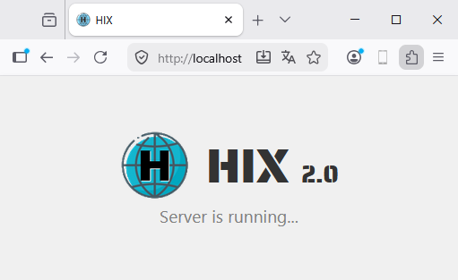
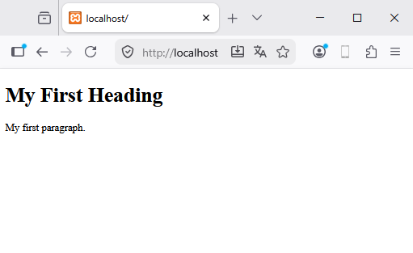
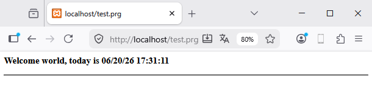
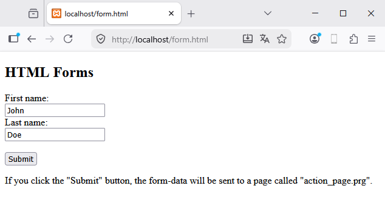
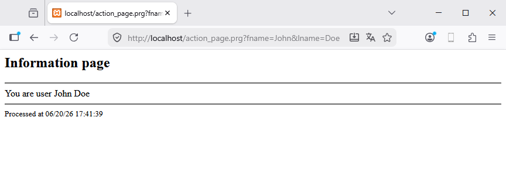

# 🕊️ Modo libre (Maverick)

**HIX** es un servidor web creado con Harbour, y su objetivo es proporcionar acceso inmediato y 
rápido a una herramienta que nos permita programar cualquier tipo de página web, servicio web, 
etc. Ha sido diseñado para un uso sencillo por cualquier usuario a cualquier nivel, y es perfecto 
para crear aplicaciones web potentes de forma fácil y segura.

El lenguaje que utilizaremos para el backend será **Harbour**, usando ficheros con extensión `.prg`. 
Podríamos decir que es un análogo a php, phyton,.. y nos ofrece una flexibilidad extraordinaria 
a la hora de crear nuestras soluciones.

Este mini-manual no explica cómo funciona la web; solo intenta explicar brevemente el uso y la 
configuración del servidor.

**HIX** nos brinda una experiencia en el momento en que arranca.




Una vez arranque el servidor, podemos empezar inmediatamente a añaadir las distintas páginas 
web que necesitamos.

Por defecto, HIX crea una carpeta /www que será nuestra carpeta raiz del sistema y que podremos 
cambiar desde el fichero de configuración `hix.json`.

Creamos un primer ejemplo básico en nuestra carpeta <root> `www/index.html`.

Pondremos el mismo código de [https://www.w3schools.com/html/tryit.asp?filename=tryhtml_basic_document](https://www.w3schools.com/html/tryit.asp?filename=tryhtml_basic_document)

```html
<!DOCTYPE html>
<html>
<body>

  <h1>My First Heading</h1>

  <p>My first paragraph.</p>

</body>
</html>
```

Si refrescamos nuestro navegador habria de aparecer la siguiente pantalla




**HIX** tiene su propio motor de vistas y podremos inyectar código Harbour dentro de las 
directivas `@prg ... @endprg`


```html
<!DOCTYPE html>
<html>
<body>

  <h1>My First Heading</h1>

  <p>My first paragraph.</p>

@prg 
  local nI 
  local cHtml := '<ul>'

  for nI := 1 to 5 
    cHtml += '<li>Line ' + str(nI) + '<br>'
  next

  cHtml += '</ul>'

  return cHtml
@endprg

</body>
</html>
```

Este código da como resultado


Todas las funcionalidades del motor de vistas las podemos consultar en el apartado 
[Motor de Vistas](../hixstyle/views/mambo.md).

Otra de las bondades de HIX es la de poder ejecutar directamente archivos *.prg, por ejemplo 
si creamos `www/test.prg` 

```clipper
function main()

   local cHtml := ''

   cHtml := '<h3>Welcome world, today is ' + dtoc( date() ) + ' ' + time()
   cHtml += '</h3><hr>'

return cHtml 
```

Y ejecutamos `https//localhost/test.prg`



## 📋 Formularios 

Podemos crear nuestros formularios usando los standares de html por ejemplo: 
[https://www.w3schools.com/html/tryit.asp?filename=tryhtml_form_submit](https://www.w3schools.com/html/tryit.asp?filename=tryhtml_form_submit).
Simplemente cambiaremos el fichero del action por uno con extensión `.prg` -> `action_page.prg`. 
Guardaremos el fichero como `form.html`.

```html
<!DOCTYPE html>
<html>
<body>

  <h2>HTML Forms</h2>

  <form action="action_page.prg">
    <label for="fname">First name:</label><br>
    <input type="text" id="fname" name="fname" value="John"><br>
    <label for="lname">Last name:</label><br>
    <input type="text" id="lname" name="lname" value="Doe"><br><br>
    <input type="submit" value="Submit">
  </form> 

  <p>If you click the "Submit" button, the form-data will be sent to a page called "action_page.prg".</p>

</body>
</html>
```

Veriamos el siguiente formulario.



Siguiendo con el ejemplo crearemos `action_page.prg` (un fichero de tipo `.prg`) para recoger 
los parámetros y, en este caso, mostrar los datos en pantalla.

```clipper
function main()

  local hData := UGet()     
  local cHtml := ''

  cHtml += '<h2>Information page</h2><hr>'
  cHtml += 'You are user ' + hData[ 'fname' ] + ' ' + hData[ 'lname' ]
  cHtml += '<hr>'
  cHtml += '<small>Processed at ' + dtoc(date()) + ' ' + time() + '</small>'
 
return cHtml 
```

Si ejecutamos `form.html` podemos ver que la acción ejecuta `action_page.prg`.



Quizás lo mas importante aquí es observar como se utiliza la función `UGet()` para recuperar 
los parámetros del formulario. Esta funcion forma parte los diferentes *Helpers* que ayudaran 
al programador. En [Helpers](../programacion/mapa-helpers.md) podeis consultar todas
las funciones disponibles.


## 📌 Resumen

**HIX** os ofrece desde el momento de arranque su potencia para poder servir de manera rápida 
vuestra web. No olvides consultar estos apartados que sumarán potencia a tu sistema.

- El [motor de vistas](../hixstyle/views/mambo.md) te dara toda la potencia para crear páginas lógicas.
- No olvides consultar el apartado de los [helpers](../programacion/mapa-helpers.md).
- Añade técnicas profesionales como [rutas](../hixstyle/routes/routes.md) a tus páginas.
