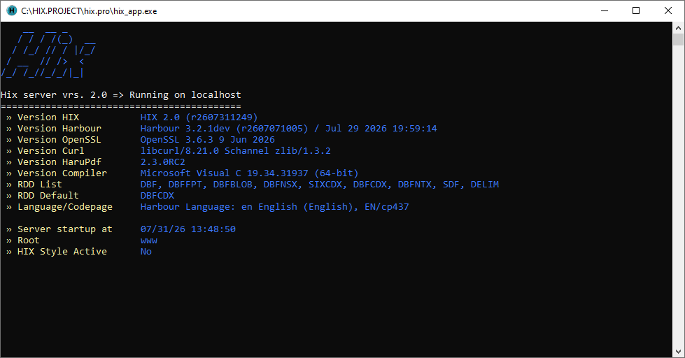

# ⚙️ Compilar proyecto HIX

### Libreria HIX_Server.lib 

**HIX** es una libreria basda en **Harbour** y en esta versión utilizamos 
el compilador **Visual Studio** (MSVC64). 

**Harbour** lo podeis descargar desde su repositorio oficial 
[https://harbour.github.io/doc/](https://harbour.github.io/doc/)

**Visual Studio** se puede descargar de 
[https://visualstudio.microsoft.com/es/vs/community/](https://visualstudio.microsoft.com/es/vs/community/)


Para poder compilar la libreria podemos usar el script `go_lib_msvc.bat`. Revise antes 
debe los paths hacia su instalación de Harbour. 


Este script genera `hix_server.lib` y `hix_server.hbx` (tabla de símbolos exportados).  


### Aplicación ejemplo 

Si desea no usar el servidor ya construido, puede crearse el suyo propio.
En el fichero `/examples/server/app.prg` hay un ejemplo hiperbásico de como crear tu servidor 
**HIX**. 

```clipper 
FUNCTION Main()

   LOCAL oServer := THixServer():New()   

   oServer:Start()
   
RETURN NIL
```

Para poderlo compilar y enlazar se proviene del bat de soporte `go_msvc.bat` y 
que se apoya en `hix.hbp` que te puede servir de base para ir incorporando 
tus ficheros y librerias externas para crear tu propio servidor.

La primera vez que arranques el servidor te muestra la configuración del servidor 



Compila tu servidor `hix.exe` enlazando contra `hix_server.lib`.  
Usa este proyecto como punto de partida: añade tus rutas, middlewares y librerías adicionales 
en `examples/server/src/app.prg` y `hix.hbp`.

Recuerda que en todos los proyectos que realizes has de copiar las dll de la carpeta /dll 
en el directorio donde tengas el server. 
