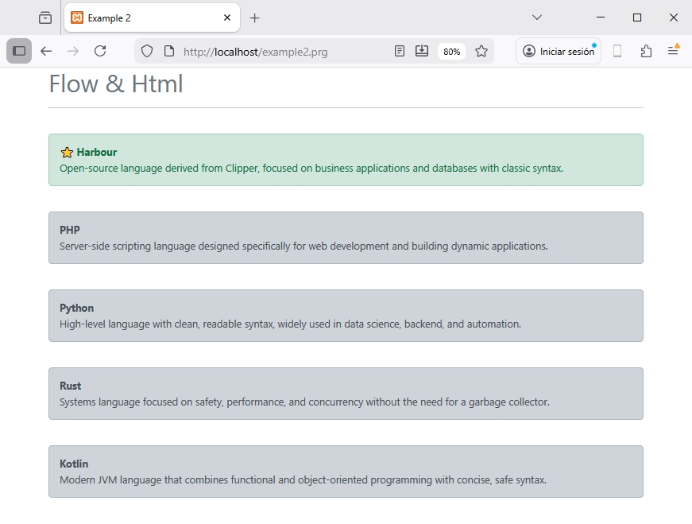

## 📖 Esempio 2 - Flusso & HTML

Questo esempio mostra come controllare il flusso delle view usando le direttive di flusso,
come @if, @foreach, @for,...

### Controller: example2.prg
```clipper
function main()	

	local aData := {;
		{ "Harbour", "Linguaggio open-source derivato da Clipper, focalizzato su applicazioni business e database con sintassi classica.", .T. },;
		{ "PHP", "Linguaggio di scripting server-side progettato specificamente per lo sviluppo web e la creazione di applicazioni dinamiche.", .F. },;
		{ "Python", "Linguaggio di alto livello con sintassi pulita e leggibile, molto usato in data science, backend e automazione.", .F. },;
		{ "Rust", "Linguaggio di sistema focalizzato su sicurezza, performance e concorrenza senza bisogno di un garbage collector.", .F. },;
		{ "Kotlin", "Linguaggio JVM moderno che combina programmazione funzionale e object-oriented con sintassi concisa e sicura.", .F. };
	}

return UView( 'example2.html', aData )
```

### View: example2.html
```
@args mydata := {}

<!DOCTYPE html>
<html lang="es">
<head>
  <meta charset="UTF-8">
  <meta name="viewport" content="width=device-width, initial-scale=1.0">
  <title>Esempio 2</title>

  <link href="https://cdn.jsdelivr.net/npm/bootstrap@5.3.0-alpha1/dist/css/bootstrap.min.css" rel="stylesheet">

</head>
<body>

<div class="container"> 
	<h1 class="text-secondary">Flusso & Html</h1>
	<hr>
	
	@for n := 1  to len( myData )
	
		<br>
		
		@if myData[n][3] 		
			
			<div class="alert alert-success" role="alert">
				<b>⭐ {{ myData[n][1]}}</b>
				<br>
				{{ myData[n][2] }}
			</div>
			
		@else 
		
			<div class="alert alert-dark" role="alert">
				<b>{{ myData[n][1]}}</b>
				<br>
				{{ myData[n][2] }}
			</div>		
			
		@endif 	
	
	@next

</div>
	
</body>
</html>	
```

### Risultato


