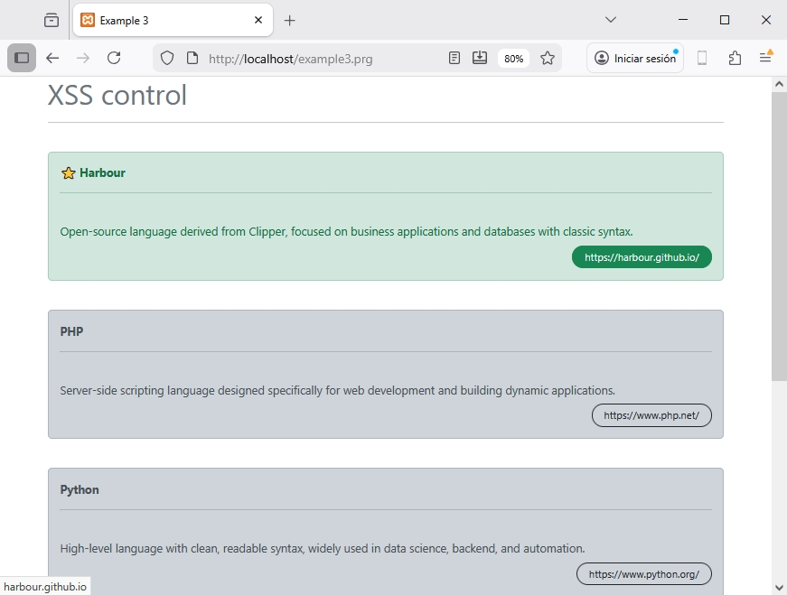

## 📖 Esempio 3 - Controllo XSS

Questo esempio mostra come la macro `{{ }}` faccia l'escape di qualsiasi valore HTML, impedendo
che codice malevolo venga iniettato. Non dobbiamo preoccuparci di nulla.
La macro `{!! !!}` può essere usata per mostrare dati HTML grezzi.

Usiamo anche la direttiva `@prg` per usare funzioni Harbour che possono supportare le nostre
view.

### Controller: example3.prg

```clipper 
function main()	

	local aData := {;
		{ "Harbour", "Linguaggio open-source derivato da Clipper, focalizzato su applicazioni business e database con sintassi classica.", .T. },;
		{ "PHP", "Linguaggio di scripting server-side progettato specificamente per lo sviluppo web e la creazione di applicazioni dinamiche.", .F. },;
		{ "Python", "Linguaggio di alto livello con sintassi pulita e leggibile, molto usato in data science, backend e automazione.", .F. },;
		{ "Rust", "Linguaggio di sistema focalizzato su sicurezza, performance e concorrenza senza bisogno di un garbage collector.", .F. },;
		{ "Kotlin", "Linguaggio JVM moderno che combina programmazione funzionale e object-oriented con sintassi concissa e sicura.", .F. };
	}
	
	local hUrls := {=>}
		hUrls[ 'Harbour' ] := 'https://harbour.github.io/' 
		hUrls[ 'PHP' ] := 'https://www.php.net/' 
		hUrls[ 'Python' ] := 'https://www.python.org/' 
		hUrls[ 'Rust' ] := 'https://rust-lang.org/es/' 
		hUrls[ 'Kotlin' ] := 'https://kotlinlang.org/' 					

return UView( 'example3.html', aData, hUrls )
```

### View: example3.html

```html 
@args mydata, urls

<!DOCTYPE html>
<html lang="es">
<head>
  <meta charset="UTF-8">
  <meta name="viewport" content="width=device-width, initial-scale=1.0">
  <title>Esempio 3</title>

  <link href="https://cdn.jsdelivr.net/npm/bootstrap@5.3.0-alpha1/dist/css/bootstrap.min.css" rel="stylesheet">

</head>
<body>


<div class="container"> 
	<h1 class="text-secondary">Controllo XSS</h1>
	<hr>
	
	@for n := 1  to len( myData )
	
		<br>
		
		@if myData[n][3] 
			
			<div class="alert alert-success" role="alert">
				<b>⭐ {{ myData[n][1]}}</b><hr>
				<br>
				{{ myData[n][2] }}
				
				<br>
				<div class="text-end">
					<a href="{!! GetUrl( myData[n][1] ) !!}" class="btn btn-outline-success btn-sm rounded-pill px-3 mt-2">
						{{ GetUrl( myData[n][1] ) }}
					</a>												
				</div>
			</div>
			
		@else 
		
			<div class="alert alert-dark" role="alert">
				<b>{{ myData[n][1]}}</b><hr>
				<br>
				{{ myData[n][2] }}
				
				
				<br>
				<div class="text-end">
					<a href="{!! GetUrl( myData[n][1] ) !!}" class="btn btn-outline-dark btn-sm rounded-pill px-3 mt-2">
						{{ GetUrl( myData[n][1] ) }}
					</a>			
				</div>
			</div>		
			
		@endif 
	
	
	@next
	
@prg 

function GetUrl( uKey )

	local cUrl := HB_HGetDef( urls, uKey, '' )

return cUrl


@endprg 	

</div>	

</body>
</html>
```

### Risultato


