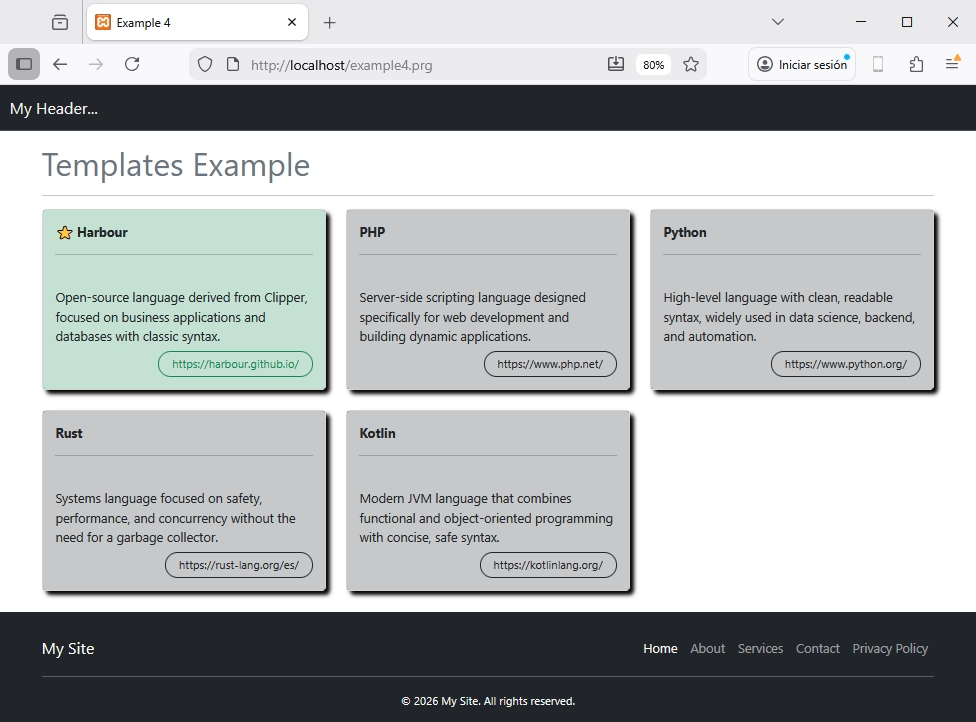

## 📖 Esempio 4 - Template

Questo esempio mostra come possiamo usare la direttiva `@view` per caricare template. Questo rende molto più facile programmare view ripetitive attraverso pagine diverse: Header, Footer, Card, ..., diverse view che useremo come template!

### Controller: example4.prg

```clipper 
function main()	

	local aData := {;
		{ "Harbour", "Linguaggio open-source derivato da Clipper, focalizzato su applicazioni business e database con sintassi classica.", .T. },;
		{ "PHP", "Linguaggio di scripting server-side progettato specificamente per lo sviluppo web e la creazione di applicazioni dinamiche.", .F. },;
		{ "Python", "Linguaggio di alto livello con sintassi pulita e leggibile, molto usato in data science, backend e automazione.", .F. },;
		{ "Rust", "Linguaggio di sistema focalizzato su sicurezza, performance e concorrenza senza bisogno di un garbage collector.", .F. },;
		{ "Kotlin", "Linguaggio JVM moderno che combina programmazione funzionale e object-oriented con sintassi concissa e sicura.", .F. };
	}
	
	local hUrls := {=>}
		hUrls[ 'Harbour' ] := 'https://harbour.github.io/' 
		hUrls[ 'PHP' ] := 'https://www.php.net/' 
		hUrls[ 'Python' ] := 'https://www.python.org/' 
		hUrls[ 'Rust' ] := 'https://rust-lang.org/es/' 
		hUrls[ 'Kotlin' ] := 'https://kotlinlang.org/' 					

return UView( 'example4.html', aData, hUrls )
```

### View: example4.html
```html 
@args mydata, urls

<!DOCTYPE html>
<html lang="es">
<head>
  <meta charset="UTF-8">
  <meta name="viewport" content="width=device-width, initial-scale=1.0">
  <title>Esempio 4</title>

  <link href="https://cdn.jsdelivr.net/npm/bootstrap@5.3.0-alpha1/dist/css/bootstrap.min.css" rel="stylesheet">

</head>

<style>
	.card {
	  box-shadow: 5px 5px 5px black;
	}

	footer {
		position: fixed;
		bottom: 0;
		width: 100%;
	}
</style>

<body class="d-flex flex-column min-vh-10">

@view 'example_header.html'

<div class="container"> 
	<h1 class="text-secondary mt-3">Esempio Template</h1>
	<hr>
	<div class="row g-4">
	
		@for n := 1  to len( myData )
			@view "example_card.html", myData[n], urls					
		@next
	
	</div> 	

</div>
<br>	

@view 'example_footer.html'

</body>
</html>
```

### View di supporto

#### Header - example_header.html
```html 
<nav class="navbar bg-dark border-bottom border-body" data-bs-theme="dark">
  <div class="container-fluid">
    <a class="navbar-brand" href="#">Usando le view...</a>
  </div>
</nav>
```

#### Footer - example_footer.html
```html 
<footer class="bg-dark text-white pt-4 mt-auto mt-5">
    <div class="container">
        <!-- Navbar dentro il footer -->
        <nav class="navbar navbar-expand-lg navbar-dark bg-dark p-0">
            <div class="container-fluid px-0">
                <a class="navbar-brand" href="#">Il mio sito</a>

                <div class="collapse navbar-collapse" id="footerNav">
                    <ul class="navbar-nav ms-auto mb-2 mb-lg-0">
                        <li class="nav-item">
                            <a class="nav-link active" aria-current="page" href="#">Home</a>
                        </li>
                        <li class="nav-item">
                            <a class="nav-link" href="#">About</a>
                        </li>
                        <li class="nav-item">
                            <a class="nav-link" href="#">Servizi</a>
                        </li>
                        <li class="nav-item">
                            <a class="nav-link" href="#">Contatti</a>
                        </li>
                        <li class="nav-item">
                            <a class="nav-link" href="#">Privacy Policy</a>
                        </li>
                    </ul>
                </div>
            </div>
        </nav>
        <hr class="my-3">
        <div class="text-center pb-3">
            <small>&copy; 2026 Il mio sito. Tutti i diritti riservati.</small>
        </div>
    </div>
</footer>
```

#### Card - example_card.html 
```html 
@args oItem, urls

<div class="col-12 col-sm-6 col-md-4">		
  <div class="card">
  
		@if oItem[3] 
			<div class="card-body bg-success bg-opacity-25">
			
				<b>⭐ {{ oItem[1]}}</b><hr>
				<br>
				{{ oItem[2] }}
				
				<br>
				<div class="text-end">
					<a href="{!! GetUrl( oItem[1] ) !!}" class="btn btn-outline-success btn-sm rounded-pill px-3 mt-2">
						{{ GetUrl( oItem[1] ) }}
					</a>												
				</div>
				
			</div>		
			
		@else 

			<div class="card-body bg-dark bg-opacity-25">
				<b>{{ oItem[1]}}</b><hr>
				<br>
				{{ oItem[2] }}				
				
				<br>
				<div class="text-end">
					<a href="{!! GetUrl( oItem[1] ) !!}" class="btn btn-outline-dark btn-sm rounded-pill px-3 mt-2">
						{{ GetUrl( oItem[1] ) }}
					</a>												
				</div>	
				
			</div>						
			
		@endif 

  </div>
</div>
	
@prg 

	function GetUrl( uKey )

		local cUrl := HB_HGetDef( urls, uKey, '' )

	return cUrl

@endprg 
```

### Risultato 


