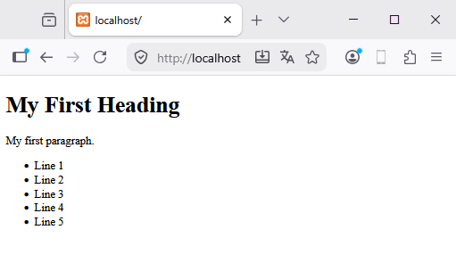

# 🕊️ Modalità libera (Maverick)

**HIX** è un web server creato con Harbour, e il suo obiettivo è fornire un accesso immediato e rapido
a uno strumento che ti permetta di programmare qualsiasi tipo di pagina web, web service, ecc. È stato
progettato per un uso semplice da parte di qualsiasi utente a qualsiasi livello, ed è perfetto per creare potenti
applicazioni web con facilità e in sicurezza.

Il linguaggio che useremo per il backend sarà **Harbour**, utilizzando file con estensione `.prg`.
Potremmo dire che è un analogo di PHP, Python e così via, e offre una flessibilità straordinaria
nella creazione delle nostre soluzioni.

Questo mini-manuale non spiega come funziona il web; cerca solo di illustrare brevemente l'uso e la
configurazione del server.

**HIX** ti offre un'esperienza pronta all'uso fin dal momento in cui si avvia.


Una volta che il server si avvia, possiamo immediatamente iniziare ad aggiungere le diverse pagine web
di cui abbiamo bisogno.

Per impostazione predefinita, HIX crea una cartella `/www` che sarà la cartella root del sistema e che possiamo
modificare dal file di configurazione `hix.json`.

Creiamo un primo esempio base nella nostra cartella root `www/index.html`.

Useremo lo stesso codice da [https://www.w3schools.com/html/tryit.asp?filename=tryhtml_basic_document](https://www.w3schools.com/html/tryit.asp?filename=tryhtml_basic_document)

```html
<!DOCTYPE html>
<html>
<body>

  <h1>My First Heading</h1>

  <p>My first paragraph.</p>

</body>
</html>
```

Se aggiorni il browser, dovrebbe apparire la seguente schermata.


**HIX** ha un proprio view engine e possiamo iniettare codice Harbour all'interno delle
direttive `@prg ... @endprg`


```html
<!DOCTYPE html>
<html>
<body>

  <h1>My First Heading</h1>

  <p>My first paragraph.</p>

@prg 
  local nI 
  local cHtml := '<ul>'

  for nI := 1 to 5 
    cHtml += '<li>Line ' + str(nI) + '<br>'
  next

  cHtml += '</ul>'

  return cHtml
@endprg

</body>
</html>
```

Questo codice produce



Puoi consultare tutte le funzionalità del view engine nella sezione
[View Engine](../hixstyle/views/mambo.md).

Un'altra caratteristica di HIX è la capacità di eseguire direttamente file `*.prg`, per esempio
se creiamo `www/test.prg`

```clipper
function main()

   local cHtml := ''

   cHtml := '<h3>Welcome world, today is ' + dtoc( date() ) + ' ' + time()
   cHtml += '</h3><hr>'

return cHtml 
```

E eseguiamo `https//localhost/test.prg`


## 📋 Form

Possiamo creare i nostri form utilizzando gli standard HTML, per esempio:
[https://www.w3schools.com/html/tryit.asp?filename=tryhtml_form_submit](https://www.w3schools.com/html/tryit.asp?filename=tryhtml_form_submit).
Modificheremo semplicemente il file action in uno con estensione `.prg` → `action_page.prg`.
Salveremo il file come `form.html`.

```html
<!DOCTYPE html>
<html>
<body>

  <h2>HTML Forms</h2>

  <form action="action_page.prg">
    <label for="fname">First name:</label><br>
    <input type="text" id="fname" name="fname" value="John"><br>
    <label for="lname">Last name:</label><br>
    <input type="text" id="lname" name="lname" value="Doe"><br><br>
    <input type="submit" value="Submit">
  </form> 

  <p>If you click the "Submit" button, the form-data will be sent to a page called "action_page.prg".</p>

</body>
</html>
```

Vedremo il seguente form.


Continuando con l'esempio, creeremo `action_page.prg` (un file di tipo `.prg`) per raccogliere
i parametri e, in questo caso, visualizzare i dati a schermo.

```clipper
function main()

  local hData := UGet()     
  local cHtml := ''

  cHtml += '<h2>Information page</h2><hr>'
  cHtml += 'You are user ' + hData[ 'fname' ] + ' ' + hData[ 'lname' ]
  cHtml += '<hr>'
  cHtml += '<small>Processed at ' + dtoc(date()) + ' ' + time() + '</small>'
 
return cHtml 
```

Se eseguiamo `form.html`, possiamo vedere che l'action esegue `action_page.prg`.


Forse la cosa più importante qui è osservare come viene utilizzata la funzione `UGet()` per recuperare
i parametri del form. Questa funzione fa parte dei diversi *Helpers* che aiuteranno il
programmatore. In [Helpers](../programacion/mapa-helpers.md) puoi consultare tutte le
funzioni disponibili.


## 📌 Riepilogo

**HIX** ti offre la potenza fin dal momento in cui si avvia per servire rapidamente il tuo web. Non dimenticare di
consultare queste sezioni che aggiungeranno potenza al tuo sistema.

- Il [view engine](../hixstyle/views/mambo.md) ti darà tutta la potenza per creare pagine logiche.
- Non dimenticare di consultare la sezione [helpers](../programacion/mapa-helpers.md).
- Aggiungi tecniche professionali come le [routes](../hixstyle/routes/routes.md) alle tue pagine.
