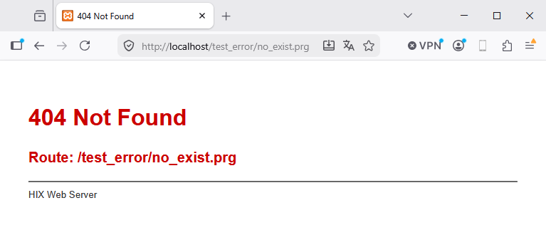

# 🛑 Errorsys - Pagina di errore personalizzata

Quando un'action fallisce, HIX renderizza una pagina HTML 500. Di default
mostra la schermata interna `HIX_ErrorSys`.

**Errorsys** ti permette di sostituire quella schermata con un template
`.html` **tuo**, sfruttando l'intero view engine di HIX.

---

## Configurazione

### Da `hix.json`

```json
"app" : { 
   "errorsys" : "errorsys.html"
}
```

### Risoluzione del path

`app.errorsys` **non include la cartella `errors/`** nel JSON. HIX la aggiunge
in base a `hixstyle.enabled`:

| `hixstyle.enabled` | Valore JSON               | Path risolto                            |
|--------------------|---------------------------|-----------------------------------------|
| `true`             | `errorsys.html`           | `<cRoot>/errors/errorsys.html`          |
| `true`             | `sub/errorsys.html`       | `<cRoot>/errors/sub/errorsys.html`      |
| `false`            | `errorsys.html`           | `<cRoot>/errorsys.html`                 |
| `false`            | `sub/errorsys.html`       | `<cRoot>/sub/errorsys.html`             |

Con `hixstyle.enabled=true`, `errors/` è una cartella di layout fissa
(come `controllers/`, `views/`, `models/`) ed è **sempre** prefissata.
`<cRoot>` proviene da `paths.root` in `hix.json` (default: `www`).

Flusso:
1. Se il template esiste **e** renderizza senza errori → viene inviato al client.
2. Se il template **fallisce nella renderizzazione** → viene mostrata la pagina *Errorsys Design Error*
   (sfondo rosso scuro) con l'errore originale più l'errore del template.
3. Se il template **non esiste** o è vuoto → fallback al renderer interno
   (`HIX_ErrorSys`, che a sua volta rispetta `app.env`).

---

## Il template `errorsys.html`

È un template HIX standard — stesso `@args`, `{{ }}` e regole di qualsiasi
file `.html`.

Riceve un singolo parametro `hError` (hash) con i campi dell'errore:

```html
@args hError

<!DOCTYPE html>
<html lang="en">
<head>
   <meta charset="UTF-8">
   <title>Error {{ hb_NToS(hError['subCode']) }}</title>
   <link href="https://cdn.jsdelivr.net/npm/bootstrap@5.3.3/dist/css/bootstrap.min.css" rel="stylesheet">
   <style>
      body { padding: 2em; font-family: system-ui, sans-serif; }
      pre  { background: #f4f4f4; padding: 1em; }
   </style>
</head>
<body>
   <h1 class="text-danger">Application Error (DEV)</h1>
   <hr>
   <table class="table table-bordered">
      <tr><th>Time</th><td>{{ dtoc(date()) + ' ' + time() }}</td></tr>
      <tr><th>Description</th><td>{{ hError['description'] }}</td></tr>
      <tr><th>Operation</th><td>{{ hError['operation'] }}</td></tr>
      <tr><th>Subsystem</th><td>{{ hError['subsystem'] }}</td></tr>
      <tr><th>File</th><td>{{ hError['file'] }}</td></tr>
      <tr><th>Line</th><td>{{ hb_NToS(hError['line']) }}</td></tr>
      <tr><th>HTTP</th><td>{{ hb_NToS(hError['subCode']) }}</td></tr>
   </table>

   <!-- Dump grezzo utile in dev: -->
   <h3>Dump completo</h3>
   {!! _w( hError ) !!}
</body>
</html>
```

Se osservi la riga `{!! _w( hError ) !!}`, mostrerà tutti i contenuti dell'hash.

---


## `www/errors/error_XXX.html` - pagine di errore HTTP statiche

Quando il router o il dispatcher genera un errore HTTP con un codice (404, 405,
403, 500…), chiama `HIX_HttpError()`, che a sua volta usa `HIX_HttpErrorHtml`.
Questa funzione cerca:

```
www/errors/error_<CODE>.html
```

- Se esiste → viene inviato così com'è come risposta HTML.
- Se non esiste → viene inviata una pagina minimale auto-generata con il titolo del codice e (opzionalmente) il dettaglio.

Esempio: per un 404, il file è `www/errors/error_404.html`.

---

## Differenza tra `errorsys` e `error_XXX.html`

|                          | `errorsys`                                          | `error_XXX.html`                    |
|--------------------------|-----------------------------------------------------|-------------------------------------|
| Si attiva quando…        | Il PRG handler genera un'**eccezione non catturata**| Il router/dispatcher restituisce uno specifico codice HTTP (404, 405, 403…) |
| Elaborato da…            | `HIX_ShowError()`                                   | `HIX_HttpErrorHtml()`               |
| Tipo di file             | Template dinamico `.html` (view engine)             | HTML puro                           |
| Riceve dati dell'errore  | Sì (`@args hError`)                                 | No                                  |
| Applica `app.env`        | Sì (influisce sul fallback interno)                 | No                                  |
| Uno o molti              | Template singolo                                    | Uno per codice HTTP                  |

In sintesi:
- **`errorsys`** = **crash** nella logica dell'app.
- **`error_XXX.html`** = risposte HTTP con codici di errore semantici.

Se si verifica un 404 standard senza questo errore definito, viene mostrata una schermata interna basilare:



Ma se definiamo `/errors/error_404.html` con qualcosa come questo:

```html
<!DOCTYPE html>
<html lang="en">
<head>
  <meta charset="UTF-8">
  <meta name="viewport" content="width=device-width, initial-scale=1.0">
  <title>HIX Error 404</title>
  <link rel="icon" type="image/x-icon" href="https://raw.githubusercontent.com/carles9000/hix/main/resources/images/hix.ico">
  <link rel="stylesheet" href="https://cdn.jsdelivr.net/npm/bootstrap@5.3.3/dist/css/bootstrap.min.css">

  <style>
    :root {
      --hix-red: #F60000;
      --hix-dark: #222222;
      --hix-gray: #717171;
    }  
  
    .mynav {
      padding: 20px 32px;
      border-bottom: 1px solid #ebebeb;
    }  
  
    body {
      font-family: 'Nunito', -apple-system, BlinkMacSystemFont, sans-serif;
      background: #fff;
      color: var(--hix-dark);
      min-height: 100vh;
    }  
	
    .error-title {
      font-size: 2.6rem;
      font-weight: 800;
      color: var(--hix-dark);
      margin-bottom: 10px;
    }
    .error-subtitle {
      color: var(--hix-gray);
      font-size: 1.2rem;
      font-weight: 400;
      margin-bottom: 14px;
    }
	
    .error-code {
      font-weight: 700;
      color: var(--hix-red);
    }	
	
    .error-section {
      min-height: calc(100vh - 74px);
    }
    .error-text {
      padding: 10px 50px 10px 50px;
    }	
  </style>
</head>
<body>

<nav class="mynav ">
  
</nav>


<div class="container error-section d-flex align-items-center fade-container">
  <div class="row w-100 align-items-center">

    <div class="col-md-6 error-text">
      <h1 class="error-title">Shoot!</h1>
      <p class="error-subtitle">Well, this is unexpected…</p>
      <p class="error-code">Error code: 404</p>      
      <p class="error-body">
        An error has occurred and we're working to fix the problem! We'll be up and running shortly.
      </p>
      <p class="error-body">
        If you need immediate help from our customer service team about an ongoing reservation, please
        <a class="lnk" href="#">call us</a>.
        If it isn't an urgent matter, please visit our
        <a class="lnk" href="#">Help Center</a>
        for additional information. Thanks for your patience!
      </p>
      <p class="error-body">
        For urgent situations please <a class="lnk" href="#">call us</a> 📞
      </p>
    </div>

    <div class="col-md-6 illustration-col">
		
    </div>

  </div>
</div>

</body>
</html>
```

Quando si verifica l'errore 404, vedremmo questo:


---

## Web vs AJAX / JSON

In `HIX_ShowError` e `HIX_HttpError` viene chiamata `HIX_WantsJson(oReq)`. Questa
funzione controlla l'header `Accept` (`application/json`) e l'`X-Requested-With`
della request, e decide:

- **JSON** → risponde con `{ "error": "...", "code": NNN }` con il corrispondente status HTTP. Ignora `errorsys` ed `error_XXX.html`.
- **HTML** → applica l'intera pipeline sopra (errorsys personalizzato → renderer interno dev/prod → pagine `error_XXX.html`).

Questo significa che:
- Lo stesso endpoint che serve HTML mostrerà la pagina errorsys.
- Lo stesso endpoint chiamato da `fetch()` con `Accept: application/json` riceverà JSON con `error` e `code`, senza HTML.

Nessuna configurazione necessaria: il rilevamento è automatico.

---

## Flusso completo (riepilogo visuale)

```
Handler PRG genera un'eccezione non catturata
        │
        ▼
hix_worker_http.prg _HixHTTPProcessOne
        │  TRY / CATCH oError
        ▼
HIX_GetErrorHandler() != NIL ?
        │            │
       yes           no
        │            │
        ▼            ▼
   custom        HIX_ShowError(oError, oReq)
   handler            │
                      ├── scrive su errors.log
                      │
                      ├── WantsJson(oReq)? → risponde JSON, fine
                      │
                      ├── app.errorsys definito e file esiste?
                      │       │
                      │      yes ─ renderizza template
                      │       │        │       │
                      │       │       ok       fail
                      │       │       │         │
                      │       │       ▼         ▼
                      │       │   risposta  design error page
                      │       │
                      │      no
                      │       │
                      │       ▼
                      └── HIX_ErrorSys(oError)
                               │
                               ├── env=dev → HIX_ErrorSysDev
                               └── env=prod → HIX_ErrorSysProd
```

Per errori HTTP semantici (404 nel router, 405 per metodo non consentito,
ecc.):

```
Router / dispatcher genera un codice HTTP
        │
        ▼
HIX_HttpError(oReq, nStatus, cDetail)
        │
        ├── WantsJson(oReq)? → JSON con {error, [detail]}
        │
        └── HIX_HttpErrorHtml(nStatus, cMsg, cDetail)
                │
                ├── www/errors/error_<nStatus>.html esiste? → invia file
                │
                └── HTML minimale auto-generato
```

---
