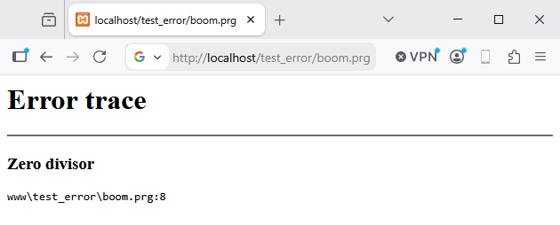
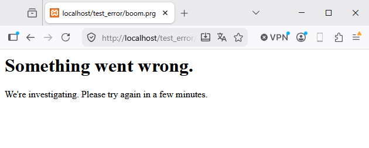

# 🛠️ Modalità Dev / Modalità Prod

**HIX** distingue due ambienti di esecuzione in base a `env`:

- **`dev`** — sviluppo locale. Tutto facilita il debug: errori dettagliati, nessuna cache degli asset, ricaricamento immediato dei template.
- **`prod`** — produzione. Tutto facilita le prestazioni e la sicurezza: errori generici, cache aggressiva, template compilati una sola volta.

Passare da una modalità all'altra è **una singola riga** — e modifica il comportamento di metà del framework.

`hix.json`
```json
"app" : {  
  "env" : "dev"          ◀───── Locale: F5 ricarica, traceback completo, nessuna cache
  "env" : "prod"         ◀───── Server reale: 500 generico, asset in cache per 1h
}
```

---

## Cosa cambia tra le modalità

| Comportamento | `dev` | `prod` |
|---|---|---|
| **Pagine di errore** | HTML dettagliato con stack + codice sorgente | 500 generico (o template errorsys minimale) |
| **`Cache-Control` per gli asset** | `no-store` — il browser non mette in cache | `public, max-age=3600` — 1 ora |
| **View `.html`** | Retranspile se il file cambia | Cache in memoria, nessun riverimento |
| **`errors.log`** | Uguale in entrambi — sempre scritto | Uguale |
| **Trace `_d()`** | Visibili se `app.debug = true` | Di solito disattivati |
| **Pannello admin** | Accesso se `lAdminEnabled=.T.` | Meglio disabilitare o limitare per IP |

> Le due differenze **visibili dal client** sono le pagine di errore e la cache. Il resto sono ottimizzazioni lato server.

---

## Pagine di errore

### In dev

`HIX_ErrorSys` renderizza un HTML esteso con una tabella dei campi dell'errore: descrizione, subsystem, operation, file, riga e codice sorgente intorno alla riga fallita evidenziata in rosso.

```
┌─────────────────────────────────┐
│  View Error                     │  
├─────────────────────────────────┤
│  Description: undefined var X   │
│  Subsystem  : BASE              │
│  File       : views/login.html  │
│  Line       : 23                │
│                                 │
│    0020  <form action="..">     │
│    0021    <input name="user">  │
│    0022    <input name="pass">  │
│ => 0023  {{ X + 1 }}            │
│    0024    <button>OK</button>  │
│    0025  </form>                │
└─────────────────────────────────┘
```

### In prod

```
┌─────────────────────────────────┐
│  500 - Internal Server Error    │
└─────────────────────────────────┘
```

Se configuri [errorsys](errorsys.md) con il tuo template, la modalità prod usa la **tua** pagina, ma con le informazioni che **tu** decidi di esporre:

```html
@args hErr

@if UIsProd()
  <h1>Si è verificato un errore.</h1>
  <p>Stiamo indagando. Riprova tra qualche minuto.</p>
@else
  <h1>{{ UHtmlEncode(hErr["description"]) }}</h1>
  <pre>{{ UHtmlEncode(hErr["file"]) }}:{{ hb_NToS(hErr["line"]) }}</pre>
@endif
```

### DEV 



### PROD




---

## Cache degli asset

Il dispatcher emette `Cache-Control` diversi in base a `cEnv` per i file serviti da `www/`:

| Modalità | Cache-Control |
|---|---|
| `dev` | `no-store` — ricarica ogni volta |
| `prod` | `public, max-age=3600` — 1 ora |

Si applica a CSS, JS, immagini e font. In dev, modifichi `app.css` e un `Ctrl+F5` lo porta istantaneamente; in prod, il browser lo riusa per un'ora senza fare una richiesta GET.

---

## Template `.html`

| Modalità | Comportamento |
|---|---|
| `dev` | Il motore ritraspile se il file è cambiato (mtime) |
| `prod` | Compila la prima volta, mette in cache, non riverifica |

In produzione, **modifica e riavvia** il server — non c'è hot-reload per i template.

---

### Log diversi per ambiente

```clipper
IF UIsDev()
   HIX_LoggerInit( "logs/hix.log", HIX_LOG_DEBUG, .T. )    // verbose + console
ELSE
   HIX_LoggerInit( "logs/hix.log", HIX_LOG_INFO,  .F. )    // solo file, info+
ENDIF
```

### CSRF / sessione più stretta in prod

```clipper
IF UIsProd()
   HIX_MwSessionSetup( "HIXSID", 1800, 60, "file", ".sessions/" )    // 30 min
ELSE
   HIX_MwSessionSetup( "HIXSID", 86400, 60, "memory" )               // 1 giorno in RAM
ENDIF
```

---


## Checklist prima di passare a `prod`

- **`app.env = "prod"`** in `hix.json`.
- **`server.ssl = true`** + certificati validi (Let's Encrypt).
- **`app.debug = false`** e livello di log impostato a `info` o `warn`.
- **`paths.errors = ".logs"`** (o una directory fuori dalla webroot).
- **Pannello admin** disabilitato o dietro whitelist IP.
- **CORS** con origini specifiche, **non** `"*"`.
- **Rate limit** attivo sugli endpoint sensibili (`/login`, ...).
- **Cookie di sessione** breve (30-60 min) e `lSessionCrypt=.T.` se basato su file.

---
