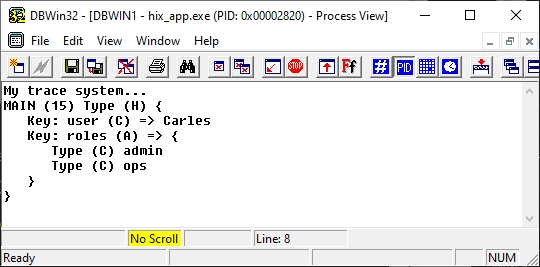
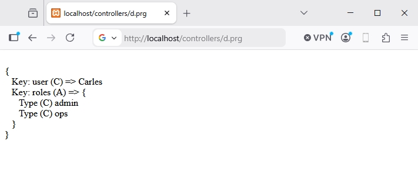

# 🔍 Tracciamento

Durante lo sviluppo, il modo più veloce per capire cosa sta succedendo nel tuo codice
non è un debugger step-by-step, ma **mettere un trace**. **HIX** espone una
famiglia di funzioni `_d()`, `_t()`, `_w()` che accettano
**qualsiasi tipo di variabile** (scalare, hash, array, oggetto) e lo stampano
formattato, con tipo e contesto.

Le funzioni `_d()` e `_t()` usano dbgView, dbwin, ecc. per Windows, e questa utility
ci permette di vedere velocemente cosa sta succedendo nel nostro codice.

```clipper
function main() 

   LOCAL hData := { "user" => "Carles", "roles" => { "admin", "ops" } }

   _t( 'Il mio sistema di trace...' )    // Solo messaggio 
   
   _d( hData )

retu nil 
```




La funzione `_w()` è come `_d()` ma converte il risultato in
formato web, e possiamo emettere il trace nel browser se vogliamo.

```clipper
function main() 

   LOCAL hData := { "user" => "Carles", "roles" => { "admin", "ops" } }   
   
   ? _w( hData )

retu nil 
```



---

## Le funzioni

| Funzione | Destinazione | Quando |
|---|---|---|
| `_d(...)` | OutputDebugString (Windows) o TraceLog (Linux/Mac) | Trace di sviluppo, visibili in DebugView |
| `_t(...)` | Come `_d` ma senza prefisso di procedura | Trace "puliti" per output massivo |
| `_w(...)` | Ritorna stringa HTML con `<br>` | Iniettare trace in una pagina HTML |


Le funzioni accettano **N argomenti** di qualsiasi tipo:

```clipper
_d( "Prima della query", hParams, nResults )
_d( "Dopo:", oUser )
```

---

## Esempi di trace

### Tracciare in un processo...

```clipper
FUNCTION _ProcessOrder( nId )
   LOCAL hOrder, lOk

   _d( "→ _ProcessOrder", nId )

   hOrder := _LoadOrder( nId )
   
   _d( "caricato:", hOrder )

   lOk := _Save( hOrder )
   _d( "← _ProcessOrder", lOk )

RETURN lOk
```

### Solo in dev

```clipper
IF UIsDev()
   _d( "Query:", cSql, "Params:", aParams )
ENDIF
```

### Ispezionare un oggetto / hash sconosciuto

```clipper
FUNCTION _Dump( xValue, cLabel )
   _d( cLabel + ":", xValue )
RETURN NIL

// ...
_Dump( oReq, "request" )
_Dump( UContext():hData, "context.data" )
```

### Dopo ogni middleware

Per capire perché un middleware fallisce:

```clipper
FUNCTION HixMwMiAuth( oCtx )
   _d( "sessione:", USession("user") )
   _d( "header:", oCtx:oReq:hHeaders )

   IF Empty( USession("user") )
      _d( "Auth FAIL — no session" )
      oCtx:lHandled := .T.
      oCtx:oReq:Redirect( "/login", 302 )
      RETURN .F.
   ENDIF

   _d( "Auth OK" )
RETURN .T.
```

### Output pulito con `_t()`

Quando sai già dove sei e vuoi solo il valore (senza
`MYFUNC (42) Type (H)`):

```clipper
_t( "Risultato:", nTotal )
// → "Risultato: 42" invece di "MYFUNC (50) Type (N) 42"
```

---

## Differenza dal Logger

| | `_d()` / `_t()` | `l()` / `ld()` / `le()` |
|---|---|---|
| Destinazione | OutputDebugString / TraceLog | `hix.log` (file) |
| Persistente | ❌ (volatile - visibile in DebugView, non salvato) | ✅ (rotazione + livelli) |
| Formato | Blocco con tipo + indentazione | Riga con timestamp + livello |
| Produzione | Rimuovilo - nessun beneficio visibile | Mantienilo - base per il troubleshooting in prod |
| Quantità consigliata | Quello che ti serve in dev | Solo eventi significativi (start, error, ...) |

Quando una funzione è stabile, **migra i trace utili a `l()`/`le()`**
ed elimina le chiamate `_d()` che servivano solo al momento.

---

## Best practice

1. **`_d()` è usa e getta.** La aggiungi per capire un bug, la rimuovi quando
   lo risolvi. Se vuoi che sopravviva, convertila in `l()` o `ld()`.
2. **Non tracciare secret.** Token, password, JWT - mai tramite
   `_d()`. Anche se è visibile solo in dev, i log di DebugView possono
   finire in uno screenshot.
3. **Wrappa in `UIsDev()` tutto ciò che potrebbe arrivare in produzione per errore.**
4. **Un trace all'ingresso, uno all'uscita.** Per le funzioni che sospetti siano
   problematiche, marca l'ingresso con gli argomenti e l'uscita con il risultato.
5. **Non lasciare trace in codice condiviso.** Se la tua PR aggiunge `_d()` in
   file del framework HIX, non passerà la review - è rumore per
   gli altri.
